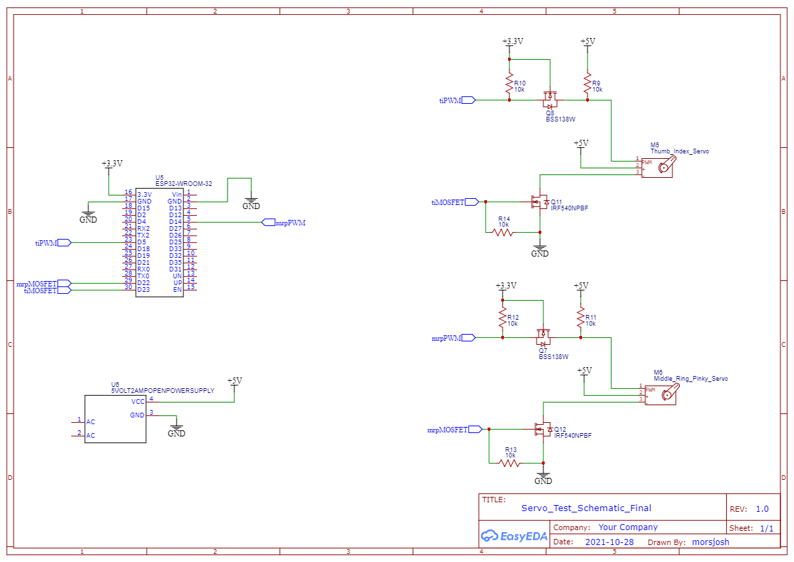

# Overview
This repo uses two different libraries to operate two PWM servos, which are connected to the ESP32, using the Arduino IDE.
# Libraries Used In the Creation of this Code

Using Arduino's servo.h library on the ESP32
(https://github.com/RoboticsBrno/ServoESP32) (ver 1.0.3)

Using Arduino IDE and arduino.h for programming the ESP32
(https://github.com/espressif/arduino-esp32) (ver 1.0.6)

Follow each repo's respecive instructions for their proper installations.

# Installation Instructions
As mentioned above, first follow each repo's respecive instructions for their proper installations. Then, download the files within the "src" folder. Lastly, put the files witnin the "src" folder into a .zip file and use the following link to install the library: (https://www.arduino.cc/en/guide/libraries#toc4). When using this repo, use the src file from Tag2 for the most up to date code.

# Utilizing the Example Code/Schematic
The example schematic should be open-able using easyEDA. Otherwise, an image of the schematic is below:
Note that a 5V power supply was used in this example schematic, in order to power the servo motors.
Also note that the schematic also uses part of the following circuit (http://cdn.sparkfun.com/datasheets/BreakoutBoards/Logic_Level_Bidirectional.pdf).
This schematic was created by sparkfun and is licensed under the following license:(https://creativecommons.org/licenses/by-sa/3.0/)

 
